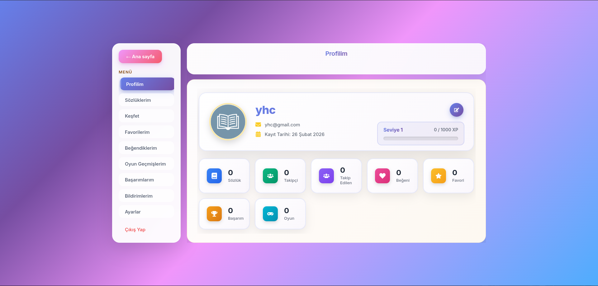
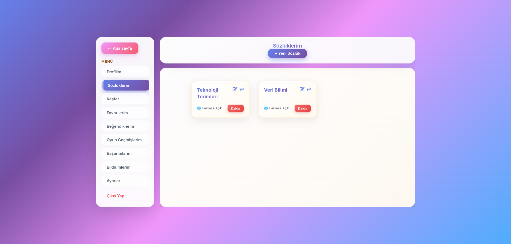
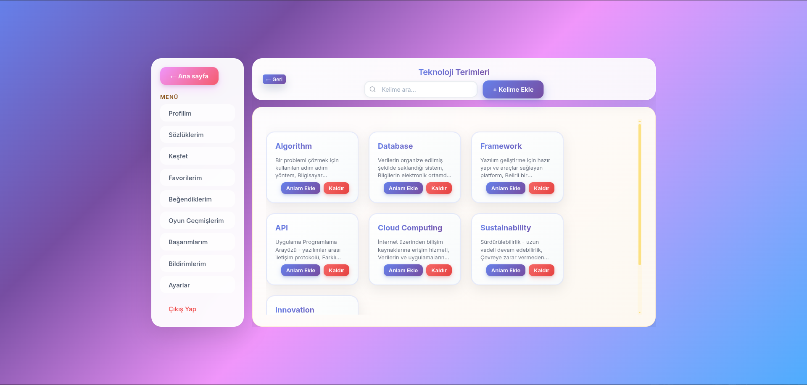
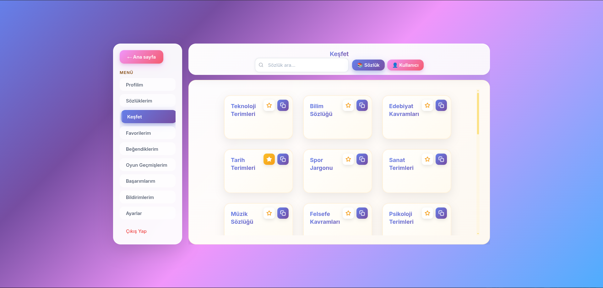
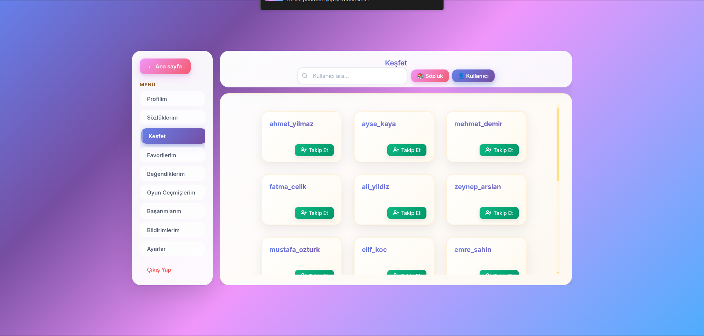
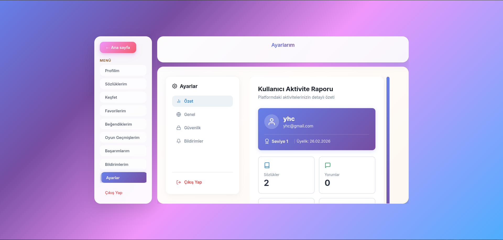

# 📖 Kapsamlı Sözlük (Dictionary) Uygulaması

> **Not:** Bu proje ticari/özel bir yazılım veya kişisel portfolyo çalışması olduğu için kaynak kodları **Private (Gizli)** bir depoda tutulmaktadır. Bu depo, projenin mimarisini, yeteneklerini ve kullanılan teknolojileri sergilemek amacıyla (Showcase) oluşturulmuştur.

## 📝 Proje Hakkında
Bu proje, modern web teknolojileri kullanılarak geliştirilmiş, uçtan uca (Full-Stack) bir Sözlük (Dictionary) uygulamasıdır. Kullanıcıların kelime veya başlık ekleyebildiği, detaylı aramalar yapabildiği ve içeriklerle etkileşime girebildiği kapsamlı bir platform sunar. 

Hem Backend mimarisindeki gelişmiş veri tabanı ilişkileri ve tasarım desenleri (Design Patterns) hem de Frontend tarafındaki güçlü state yönetimi ile öne çıkar.

## ✨ Temel Özellikler

*   **🔍 Kapsamlı Sözlük İşlevleri:** Gelişmiş içerik yönetimi; başlık oluşturma, entry(içerik) ekleme ve detaylı arama özellikleri.
*   **🔒 Katmanlı Güvenlik (JWT & Security):** Spring Security destekli, JSON Web Token (JWT) tabanlı güvenli kimlik doğrulama ve yetkilendirme (özel rol tabanlı erişim) sistemi.
*   **📐 Gelişmiş Mimari ve Tasarım Desenleri:** Backend tarafında sürdürülebilirliği sağlamak ve kod modülerliğini artırmak adına Prototype vb. çeşitli Design Pattern'ler (Tasarım Desenleri) kurgulandık.
*   **📝 Dinamik Form ve Durum Yönetimi:** Frontend tarafında karmaşık form yapıları Formik ve Yup ile anlık doğrulanırken, uygulamanın genel performansı Redux Toolkit (State Management) ile optimize ettik.

## 💻 Kullanılan Teknolojiler ve Mimari

### Frontend (İstemci - Client)
*   **Geliştirme Ortamı:** React.js ve Vite
*   **State Management:** Redux Toolkit (Merkezi durum yönetimi için)
*   **Form Yönetimi ve Validasyon:** Formik & Yup
*   **Ağ İstekleri:** Axios
*   **Yönlendirme (Routing):** React Router DOM

### Backend (Sunucu)
*   **Core:** Java 21 & Spring Boot 3
*   **Veri Erişimi:** Spring Data JPA / Hibernate
*   **Güvenlik:** Spring Security & JWT (JSON Web Token)
*   **Tasarım Mimarisi:** İleri düzey nesne yönelimli tasarım ve spesifik Design pattern uygulamaları.
*   **Test & Dokümantasyon:** Uygulama içi entegrasyon için detaylı Postman API Collection uç noktaları(endpoints).

### Veritabanı
*   **Relational Database:** PostgreSQL. Çoklu tablolar arası (Many-to-Many, Many-to-One) ilişkilerin (Entity Relationships) titizlikle kurulduğu güvenilir bir yapı.

## 📸 Ekran Görüntüleri ve Akış

### 1. Ana Sayfa ve Keşfet
 
- - -

- - -

- - -

- - - 

- - - 

*Kullanıcıların içerik ürettiği ve etkileşime girdiği dinamik form ekranları.*

## 💡 Mimari ve Geliştirme Yaklaşımı / Çözülen Zorluklar

Bu proje, arka planda ciddi bir mimari mühendislik çalışması barındırmaktadır. Geliştirme sürecinde öne çıkan bazı mimari kararlarımız:

*   **Veritabanı Relasyon Optimizasyonu:** ER Modellemeleri detaylıca yapılarak, Many-to-Many(M2M) ve Many-to-One(M2O) ilişkilerdeki ekleme, silme ve veri tutarsızlığı anormalliklerinin kökten önüne geçtik.
*   **Tasarım Desenleri (Design Patterns) Entegrasyonu:** Kodun tekrar edilebilirliğini azaltmak ve daha modüler bir altyapı (Örn: Dictionary nesnelerinin yönetimi) kurmak adına sistem yeniden düzenledik.
*   **Güvenilir Frontend Çıkartmaları:** Token yönetiminin Axios interceptor'ları ile otomatik yönetilmesi ve sayfalar arası rotalamada yetkisiz girişleri önleyen(React Router DOM) gelişmiş Guard yapıları sağladık.

---
**Geliştiriciler:**  Enes Hasanbeşe, Muhammed Baki Aslanhan, Muhammed Sabri Şık, Yusuf Harun Canbay
---
Bize ulaşmak veya bu projenin detaylı mimarisi (ER Diyagramları, Tasarım Desenleri ve DB İlişkileri) hakkında daha fazla konuşmak isterseniz profillerimizdeki e-posta adresinden veya LinkedIn üzerinden iletişime geçebilirsiniz.

